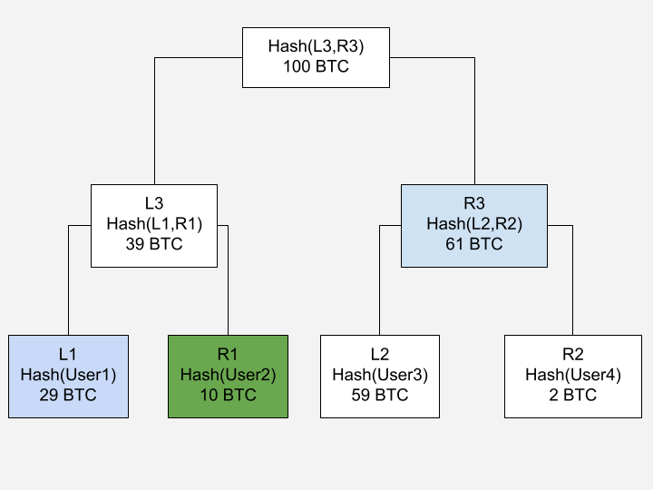
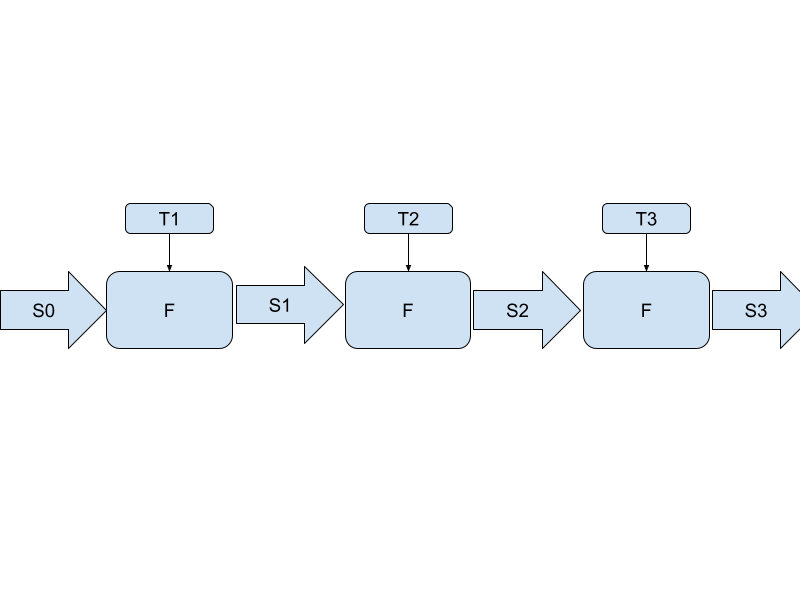
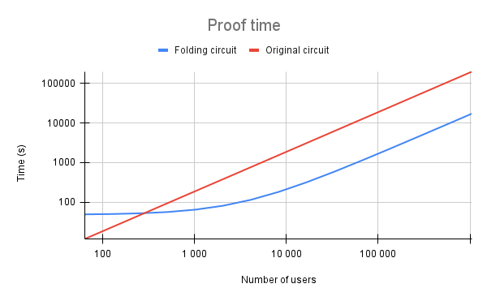

# Proof of Solvency

This project demonstrates the integration of the Nova folding scheme with proof of solvency circuits to significantly reduce the computational workload required for verifying multiple Merkle sum trees and balance inclusions.

## Circuits Description

### Liabilities

The proof of liabilities operates on a list of balances and a list of email hashes as private inputs. The main purposes of the circuit are:

1. **Validation:** Ensure all values are non-negative and fall within a specified range to prevent overflow or underflow issues, given that the operations occur within a finite field.
2. **Merkle Tree Construction:** Construct a Merkle sum tree and output the total balance sum and the root hash of the Merkle tree.


### Inclusion

The proof of inclusion aims to prove that the balance of a user is included in the Merkle Tree created in the proof of liabilities. To prove that a balance is included, it is sufficient to show that you know the Merkle path of a user balance.

#### Example

Below is a visualization of a Merkle sum tree. Each node contains a hash and the sum of balances in its subtree:

<p align="center">
  
</p>

This diagram shows a Merkle sum tree with 4 users and a total of 100 BTC in liabilities.


#### Merkle Path Example

In the diagram above, to prove inclusion of node **R1** (User2 with 10 BTC), we provide the Merkle path consisting of the sibling nodes:
- **L1** (User1, 29 BTC) - sibling at leaf level
- **R3** (61 BTC) - sibling at intermediate level

**Verification Process:**
1. Start with target leaf R1: `Hash(User2)` with balance 10 BTC
2. Combine with sibling L1: `Hash(L1, R1)` → produces L3 with sum 39 BTC (29 + 10)
3. Combine L3 with sibling R3: `Hash(L3, R3)` → produces root with sum 100 BTC (39 + 61)
4. Verify the computed root matches the expected root hash ✓
5. Verify the total sum equals the claimed total liabilities ✓


### Liabilities Changes

Once we have the initial tree proved, we can generate a proof of the changes to reduce the workload. Each change require only 1 merkle path, and is similar to the inclusion circuit. We first prove that the initial_value + path = old_state, and then new_value + path = new_state.

### Nova Folding Scheme Circuits

To implement folding, we slightly adjust the way we build the changes circuit. Everything except the way we handle inputs and outputs stays the same. The private inputs vary for every instance, while the public inputs are carried over from round to round.

<p align="center">
  
</p>

**Legend:**
- **F**: Circuit function applied at each folding step
- **S**: Step in/out - values shared between each fold (public inputs/outputs)
- **T**: Step-specific inputs - unique inputs for each folding step (public or private)


Using the Nova folding scheme, we can prove the balance of a user is included at multiple points in time. For instance, we can have 365 steps, one for each day, to prove that the balance of the user was included every day in the last year.


### Compile, integrate and test

When running integrations test, you have to be careful which circuit version is compiled. Depending on the size of your tree
and the number of changes, your number of inputs will change. You have to modify the tests accordingly.

## Run the Circuits Tests

```sh
make test
```

## Compile the Circuits for Nova

```sh
make compile
```

## Nova integration tests

```sh
make nova-test
```

### Additional Information

For a more in-depth understanding of the circuits, including performance and optimization analysis, please refer to my upcoming thesis.

### Warning

Nova do not use the same field size as circom. This causes hash values to be different in the 2 tests we are running (simple circom tests vs nova integration test).
To visualize the hash values of your tree in circom, you can use the MiMC.js file of this repo.
For Nova, you can use this other repo that I created: https://github.com/AntoineCyr/merkle_sum_proof
The nova integration uses this repo to build the tree.


### Benchmarks

#### Liabilities circuit 

There is an initial cost to folding, however the cost after some time converges to 10x better.

<p align="center">
  
</p>
