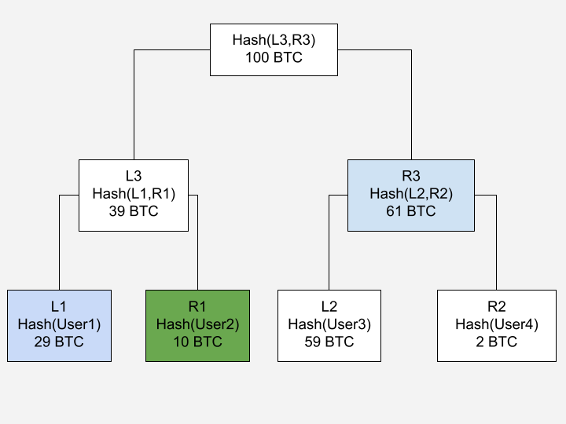
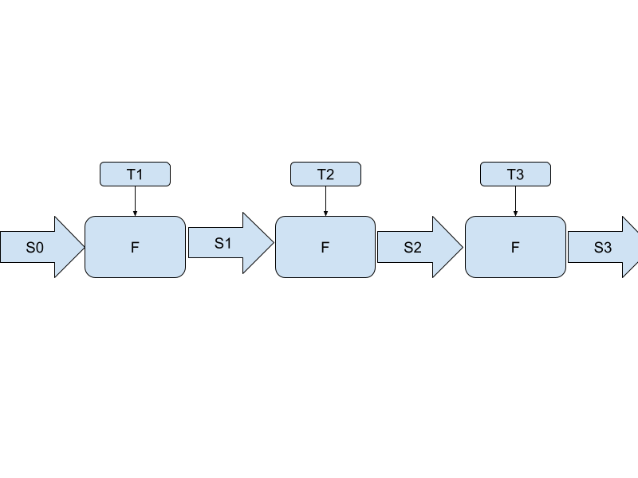
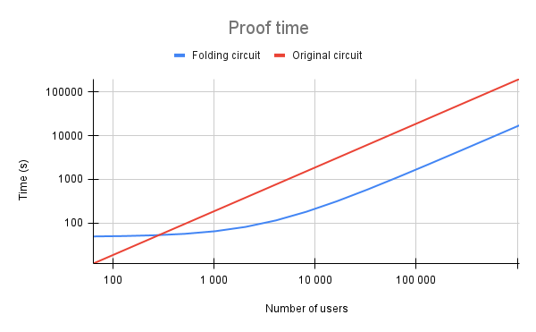

# Proof of Solvency

Zero-knowledge proof system demonstrating proof of solvency using Merkle sum trees and Nova folding scheme integration to reduce proving time by 10x.

## Project Structure

- **[circuits/](circuits/)** - Circom circuit implementations
- **[nova/](nova/)** - Nova folding scheme examples and integration with circuits
- **[nova-scotia/](nova-scotia/)** - Dependency (should be migrated to linked dependency)

## Circuits

### 1. **liabilities**
Constructs a Merkle sum tree from user balances and email hashes.

**Inputs:** List of user's balance

**Outputs:** Total sum and root hash

**Constraints:**
- Input range check
- Tree construction

### 2. **inclusion**
Proves a user's balance is included in the Merkle sum tree via Merkle path verification.

<p align="center">
  
</p>

**Inputs:**
- User node
- Root hash, sum
- Merkle path (private)

### 3. **liabilities_changes**
Proves state transitions by verifying both old and new Merkle paths for balance updates.

**Process:** `old_value + path = old_state` -> `new_value + path = new_state`

### 4. **liabilities_changes_folding**
Adapted for Nova folding scheme with modified input/output handling. Public inputs carry over between folds while private inputs vary per instance.

<p align="center">
  
</p>

**Legend:** F=Circuit function, S=Step in/out (public), T=Step inputs (private)

**Use case:** Prove daily balance inclusions with a single succinct proof.

## Testing

### Circuit Tests (Circom)
```sh
make test
```
Runs mocha tests for all circuits: [liabilitiesTest.js](circuits/test/liabilitiesTest.js), [inclusionTest.js](circuits/test/inclusionTest.js), [liabilitiesChange.js](circuits/test/liabilitiesChange.js), [liabilitiesChangeFolding.js](circuits/test/liabilitiesChangeFolding.js)

### Nova Integration Tests
```sh
make compile    # Compile circuits for Nova (vesta/bn128 fields)
make nova-test  # Run integration tests
```

Runs: `cargo run liabilities` and `cargo run inclusion` in [nova/](nova/) directory

## Hash Visualization

**Important:** Nova and Circom use different field sizes, producing different hash values.

**Circom (bn128):** Use [MiMC.js](MiMC.js)
```sh
make mimc
```

**Nova (vesta):** Use [merkle_sum_proof](https://github.com/AntoineCyr/merkle_sum_proof) repo

## Performance

Folding reduces proof costs by ~10x after convergence:

<p align="center">
  
</p>

## Notes

- Tree depth and number of changes must match between circuit compilation and tests
- Modify template parameters in circuit files based on your use case (default: 2 levels, 1 change)

## Potential Improvements

**1. Parameterized Circuit Testing & Configuration**
- Currently, tree levels and changes are hardcoded (`component main = sumMerkleTree(2)`) requiring manual test updates
- Add config-driven build: `make compile-liabilities LEVELS=4 CHANGES=3` generates circuits and matching test fixtures
- Enable multi-level test matrix (4, 16, 64, 256 leaves) with automated performance benchmarking

**2. Unified Hash Computation**
- Integrate [merkle_sum_proof](https://github.com/AntoineCyr/merkle_sum_proof) repo to provide consistent hash calculation for both Circom (bn128) and Nova (vesta)
- Replace separate [MiMC.js](MiMC.js) with unified tooling
